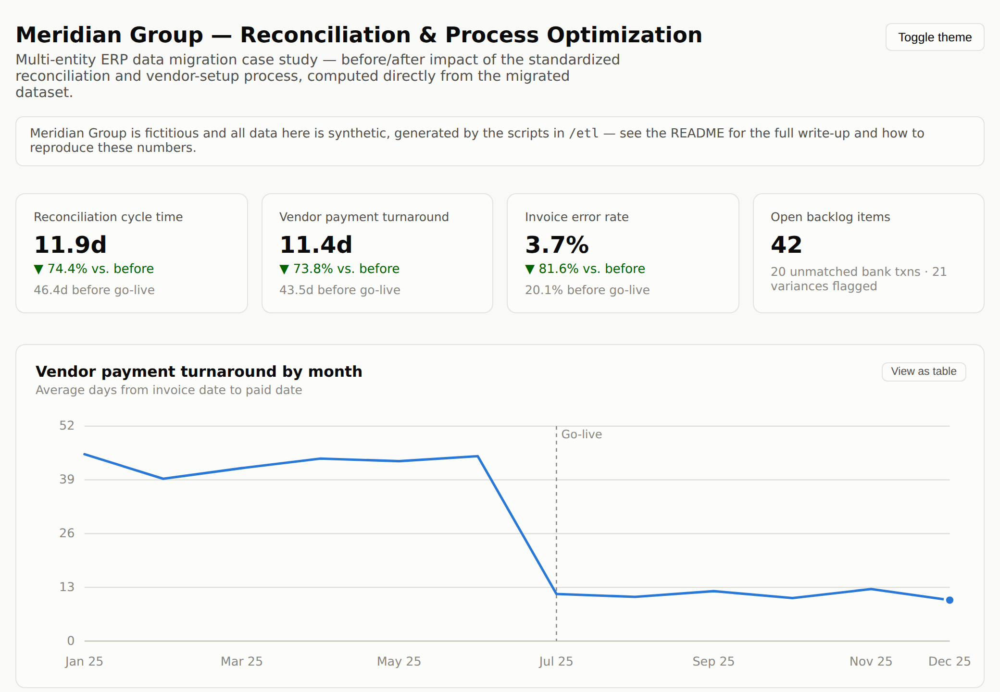

# ERP Implementation & Process Optimization Case Study

A self-directed project showing what an ERP/systems implementation and process optimization engagement actually looks like end to end — the data model, the migration code, the automation, and the reporting, not just the summary line.

**Skills shown:** SQL (schema design, exception-based reconciliation) · Python (ETL, data migration, automation) · data modeling & de-duplication · process redesign · KPI reporting · Power BI (documented) · project documentation (charter through post-launch runbook)

## [Live dashboard](https://sutejmeghawala.github.io/ERP-implementation-case-study/)



Numbers come straight out of the pipeline below, not typed in by hand:

| Metric | Before | After go-live (2025-07-01) | Change |
|---|---|---|---|
| Reconciliation cycle time | 46.4 days | 11.9 days | 74.4% faster |
| Vendor payment turnaround | 43.5 days | 11.4 days | 73.8% faster |
| Invoice error rate (duplicate/missing PO) | 20.1% | 3.7% | 81.6% reduction |
| Open reconciliation backlog | — | 42 items | full monthly trend on the dashboard |

## The scenario

Meridian Group is a fictitious holding company with three entities — Meridian North, Meridian West, and Meridian Coastal — each keeping its own spreadsheet for vendors, invoices, and bank reconciliation: no shared vendor master, three different date formats, three different ways of writing "Net 30." I took on the Business Systems Analyst role for the project: migrating and de-duplicating the data, building an automated vendor-validation gate, replacing manual reconciliation with exception-based matching, and shipping the KPI dashboard above.

Meridian Group and its data are invented for this project — generated by the scripts in `/etl` with a fixed seed, so the results are exactly reproducible — but the scenario and the mechanics (the migration structure, the reconciliation logic, what the vendor validation gate checks) reflect real systems and process work I've done professionally.

The full project record is in `/docs` — charter, current- and future-state assessment, migration plan, vendor setup SOP, UAT test plan, cutover plan, and support runbook, in that order if you want to read it like a real project folder.

## What's in here

| Part | What it shows |
|---|---|
| `sql/schema.sql` | The relational model — one canonical vendor per real-world vendor, a crosswalk back to each entity's legacy ID, invoices and bank transactions keyed off both |
| `etl/generate_legacy_data.py` → `migrate_and_cleanse.py` | The migration itself: three inconsistent legacy sources in, one clean unified dataset out |
| `automation/vendor_setup_validation.py` | The validation gate that catches a bad vendor record before it reaches a payment |
| `sql/reconciliation_queries.sql`, `sql/kpi_queries.sql` | Exception-based reconciliation and the KPI math behind the dashboard |
| `etl/invoice_integration_simulation.py` | Runs the matching engine and renders the dashboard from the results |
| `index.html` | The KPI dashboard — plain HTML/JS/SVG, no framework, no server required |
| `power-bi/dax-and-powerquery-notes.md` | The Power Query and DAX that would produce the same KPIs in an actual Power BI report |
| `/docs` | The eight-document project record, charter through support runbook, including the before/after process diagrams |

## Running it yourself

```bash
# 1. Generate the synthetic legacy data (3 entities, 12 months, deliberately messy)
python3 etl/generate_legacy_data.py

# 2. Migrate and cleanse into the unified schema
python3 etl/migrate_and_cleanse.py

# 3. Run reconciliation + rebuild the dashboard
python3 etl/invoice_integration_simulation.py

# 4. Run the vendor validation gate
python3 automation/vendor_setup_validation.py

# 5. Open index.html — it's self-contained, no server needed
```

Standard library only (`csv`, `sqlite3`, `json`) — nothing to install. Step 3 rebuilds `index.html` at the repo root with the KPI numbers baked directly into the page, so it opens correctly whether you're double-clicking it locally or viewing it through GitHub Pages.

## Making the dashboard link live

Settings → Pages → Deploy from a branch → `main` / root → Save. GitHub gives you a URL a minute or two later, and since the dashboard lives at the repo root, that URL *is* the dashboard — no sub-path to remember.
